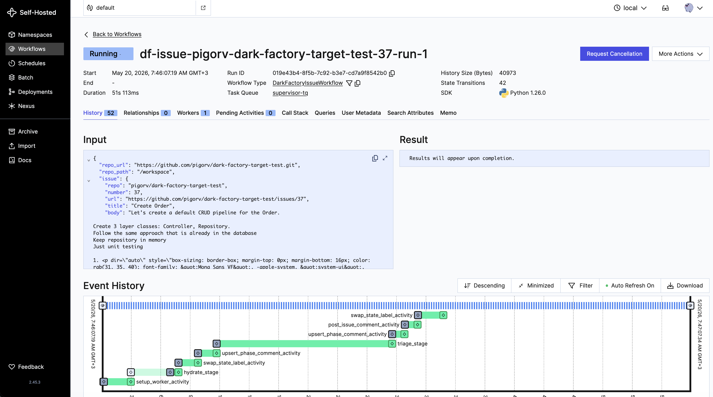
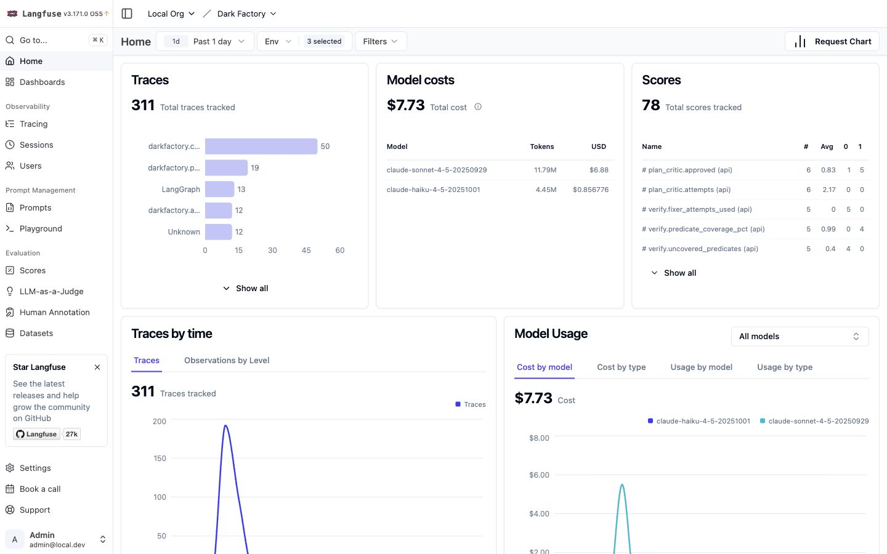
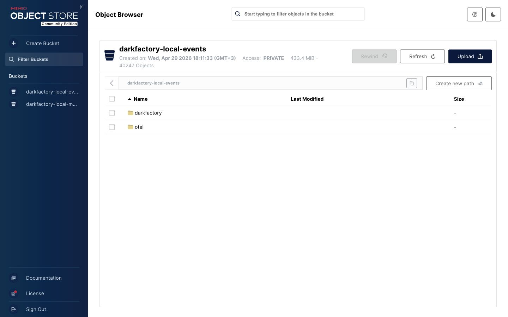

# local-dafa

*local Dark Factory — an autonomous coding pipeline: prompt or labeled GitHub issue → reviewed PR. A learning artifact for composing the 2026 agentic workflow stack — Temporal, Claude Agent SDK, LangGraph, Langfuse, OpenTelemetry.*

https://github.com/user-attachments/assets/c57ef717-3ac7-4d22-a570-cf1bd330df78

*54s cut of a ~15min real run, sped up.*

- A real, working composition of current agentic-workflow components — meant to be forked, taken apart, and learned from.
- A learning artifact, not a product. No SaaS, no signups, no roadmap promises.

---

## Table of Contents

- [How It Works](#how-it-works)
- [Prerequisites](#prerequisites)
- [Setup](#setup)
- [Configuration](#configuration)
- [Running a Workflow](#running-a-workflow)
- [GitHub Issue Automation](#github-issue-automation)
- [Dashboards and Local URLs](#dashboards-and-local-urls)
- [CLI Reference](#cli-reference)
- [Agent Roles](#agent-roles)
- [Prompt Management](#prompt-management)
- [LangGraph Studio](#langgraph-studio)
- [Worker Images](#worker-images)
- [Tests](#tests)
- [Repository Map](#repository-map)
- [Screenshots](#screenshots)

---

## How It Works

Dark Factory has three process layers:

```
┌────────────────────────────────────────────────────────────────┐
│  Host                                                          │
│  ┌──────────────┐                                              │
│  │  CLI         │  uv run darkfactory run "..." --repo /path   │
│  └──────┬───────┘                                              │
└─────────┼──────────────────────────────────────────────────────┘
          │ Temporal gRPC (localhost:7233)
┌─────────▼──────────────────────────────────────────────────────┐
│  Docker Compose stack                                          │
│  ┌────────────────────────┐   ┌──────────────────────────────┐ │
│  │  Orchestrator          │   │  Per-workflow worker         │ │
│  │  (supervisor-tq)       │──▶│  (agent-tq-<wf_id>)          │ │
│  │  • workflow definitions│   │  • Claude agent SDK calls    │ │
│  │  • launches worker     │   │  • target repo commands      │ │
│  │    containers          │   │  • runs in /workspace        │ │
│  └────────────────────────┘   └──────────────────────────────┘ │
│                                                                │
│  Support services: Temporal · Langfuse · OTel · MinIO ·        │
│                    Postgres · ClickHouse ·                     │
│                     Redis · Claude Monitor                     │
└────────────────────────────────────────────────────────────────┘
```

### Workflow stages

```
Hydrate → Triage → [PO → Architect → Plan Critic] × up to 5
        → Brief gate (human optional) → Build + Test
        → Verify / Fixer loop → PR Creator → Reviewer
        → Merge gate (human optional) → Merge
```

Human gates are opt-in: they pause the workflow until you apply a GitHub label
or post an approval comment. You can skip gates by automating label application.

---

## Prerequisites

| Requirement | Notes |
|---|---|
| macOS, Linux, or WSL | Docker must be available. |
| Docker Desktop or Engine with Compose v2 | The orchestrator mounts `/var/run/docker.sock` to launch worker containers. |
| Python 3.13 | Managed by `uv`; no system-wide install needed if using `uv`. |
| [`uv`](https://docs.astral.sh/uv/) | Python package and virtualenv manager. `curl -LsSf https://astral.sh/uv/install.sh \| sh` |
| Claude Code CLI (`claude`) | Install: `npm install -g @anthropic-ai/claude-code` |
| Claude Code OAuth token | Generate with `claude setup-token` after installing the CLI. |
| GitHub token (for PR/issue workflows) | Fine-grained token with `contents`, `issues`, and `pull_requests` **write** access on the target repo. |
| GitHub CLI (`gh`) | Optional, used by helper scripts. `brew install gh` / [releases](https://cli.github.com). |

---

## Setup

### 1. Clone and install dependencies

```bash
git clone https://github.com/your-org/dark-factory.git
cd dark-factory
uv sync
```

### 2. Create your `.env` file

```bash
cp .env.example .env
```

Open `.env` and fill in the required values (see [Configuration](#configuration)
for the full reference). At minimum:

```bash
CLAUDE_CODE_OAUTH_TOKEN=<your-token>   # from: claude setup-token
GITHUB_TOKEN=<your-github-pat>         # fine-grained PAT with issues + PR write
```

### 3. Build the worker image

The polyglot worker image bundles Python, Node.js, Java, `git`, `gh`, Claude
Code, and the Dark Factory runtime. Build it once before the first run:

```bash
docker compose --profile worker-image build darkfactory-worker-image
```

This step is separate so you can rebuild the worker image independently without
restarting the rest of the stack.

### 4. Start the local stack

```bash
docker compose up -d
```

This starts all services: Temporal, Langfuse (+ Postgres, ClickHouse, Redis,
MinIO), OpenTelemetry collector, transcript transformer, Claude Monitor, and the
Dark Factory orchestrator.

Check that every service is healthy:

```bash
docker compose ps
```

All containers should reach `healthy` or `running` within 30–60 seconds. The
Langfuse web UI is slow to start on first boot (database migrations run on
startup).

### 5. Smoke-test the worker plumbing

```bash
uv run darkfactory run --hello-worker --repo /absolute/path/to/any/repo
```

This confirms the orchestrator can launch a worker container and that the worker
can connect back to Temporal — no LLMs are invoked.

### 6. Run a real workflow

```bash
uv run darkfactory run "Add input validation to the login form" \
  --repo /absolute/path/to/target/repo
```

The CLI prints the workflow ID and streams result status. Open
[Temporal UI](http://localhost:8233) and [Langfuse](http://localhost:3000) to
watch progress in real time.

### 7. Stop the stack

```bash
docker compose down          # stop containers, keep volumes
docker compose down -v       # stop containers and delete all local state
```

---

## Configuration

Copy `.env.example` to `.env` and edit it. The table below covers every
variable.

### Required

| Variable | Description |
|---|---|
| `CLAUDE_CODE_OAUTH_TOKEN` | OAuth token for the Claude Code CLI. Generate with `claude setup-token`. Passed into every worker container. |
| `GITHUB_TOKEN` | GitHub PAT used by `gh` and `git push` inside the worker. Needs `contents`, `issues`, `pull_requests` write on the target repo. |

### Temporal

| Variable | Default | Description |
|---|---|---|
| `TEMPORAL_ADDRESS` | `localhost:7233` | Temporal frontend endpoint for host-run CLI commands. Compose sets `temporal:7233` inside containers automatically. |

### Observability

| Variable | Default | Description |
|---|---|---|
| `OTEL_EXPORTER_OTLP_ENDPOINT` | `http://localhost:4317` | OTel collector for host-run commands. Compose overrides to `http://otel-collector:4317` inside containers. |
| `OTEL_SDK_DISABLED` | _(unset)_ | Set `true` to skip OTel entirely when no collector is running. |
| `LANGFUSE_HOST` | `http://localhost:3000` | Langfuse endpoint for host-run commands. Compose overrides inside containers. |
| `LANGFUSE_PUBLIC_KEY` | `pk-lf-local` | Langfuse project public key. The local Compose stack pre-seeds this value. |
| `LANGFUSE_SECRET_KEY` | `sk-lf-local` | Langfuse project secret key. The local Compose stack pre-seeds this value. |
| `LANGFUSE_PROMPTS_ENABLED` | `true` | When `true`, roles fetch prompts from Langfuse first; disk prompts are fallback. |
| `LANGFUSE_PROMPT_LABEL` | `production` | Langfuse prompt label to fetch. |

### GitHub issue watcher

| Variable | Default | Description |
|---|---|---|
| `DF_WATCH_REPO` | _(empty)_ | Default `owner/name` when `--repo` is omitted from schedule commands. |
| `DF_WATCH_LABEL` | `df:ready` | GitHub label the poller filters on. |
| `DF_WATCH_INTERVAL_S` | `60` | Polling interval in seconds. |
| `DF_WATCH_MAX_CONCURRENT` | `3` | Maximum simultaneous issue workflows. |

### Worker and debugging

| Variable | Default | Description |
|---|---|---|
| `DARKFACTORY_WORKER_IMAGE` | `darkfactory-worker:polyglot` | Docker image tag used for per-workflow workers. |
| `DARKFACTORY_LOG_SDK_ARGV` | _(unset)_ | Set any non-empty value to log Claude SDK arguments. Do not use in production — logs contain prompt content. |
| `DARKFACTORY_ENVIRONMENT` | `local` | Tags spans and traces with an environment label. |

### Langfuse self-hosted secrets

> Change these before any shared or production deployment.

| Variable | Default |
|---|---|
| `LANGFUSE_NEXTAUTH_SECRET` | `darkfactory-demo-nextauth-change-me` |
| `LANGFUSE_SALT` | `darkfactory-demo-salt-change-me` |
| `LANGFUSE_ENCRYPTION_KEY` | `0000…0` (64 hex zeros) |
| `LANGFUSE_S3_EVENT_UPLOAD_BUCKET` | `darkfactory-local-events` |
| `LANGFUSE_S3_MEDIA_UPLOAD_BUCKET` | `darkfactory-local-media` |

### Per-role model overrides

Uncomment and edit any `LLM_<ROLE>_MODEL` / `LLM_<ROLE>_THINKING` line in
`.env.example` to override the model for a specific role. Defaults are defined
in `src/darkfactory/llm_factory.py`.

```bash
# Example: use a faster model for the PO role
LLM_PO_MODEL=claude-haiku-4-5-20251001
LLM_PO_THINKING=off

# Example: enable extended thinking for the Architect
LLM_ARCHITECT_THINKING=on
```

---

## Running a Workflow

### Manual prompt

```bash
uv run darkfactory run "Implement X" --repo /absolute/path/to/target/repo
```

The CLI starts the workflow and waits for the result. To fire-and-forget:

```bash
uv run darkfactory run "Implement X" --repo /path/to/repo --no-wait
```

### Smoke test (no LLMs)

```bash
uv run darkfactory run --hello-worker --repo /path/to/repo
```

### Human gates

The workflow pauses at two optional human gates:

**Brief gate** — after planning completes, the workflow posts the
implementation brief as a GitHub issue comment (issue-driven mode) or waits for
a Temporal update (manual mode). Actions:

| Action | How |
|---|---|
| Approve | Apply `df:approved` label or post `approve` comment |
| Revise | Post `revise: <feedback>` comment |
| Reject | Post `reject` comment or apply `df:cancel` label |

**Merge gate** — after the reviewer approves, the workflow pauses before
merging. Actions:

| Action | How |
|---|---|
| Approve and merge | Apply `df:approved` label or post `approve` comment |
| Request fix | Post `fix: <instructions>` comment |
| Rebuild | Post `rebuild` comment |
| Reject | Apply `df:cancel` label or post `reject` comment |

---

## GitHub Issue Automation

Dark Factory can watch a GitHub repository for labeled issues and run the full
pipeline automatically.

### 1. Create the required labels on the target repository

```bash
# Preview (no changes)
./scripts/sync_github_labels.py owner/name --dry-run

# Apply
./scripts/sync_github_labels.py owner/name
```

This creates all `df:*` labels. See [`docs/github-labels.md`](docs/github-labels.md)
for the full label contract.

### 2. Configure `.env`

```bash
GITHUB_TOKEN=<token-with-issues-and-pr-write>
DF_WATCH_REPO=owner/name
DF_WATCH_LABEL=df:ready
```

### 3. Start the stack

```bash
docker compose up -d
```

### 4. Install the Temporal schedule

```bash
uv run darkfactory schedule install \
  --repo owner/name \
  --label df:ready \
  --interval 60s
```

### 5. Trigger a run

Apply the `df:ready` label to any GitHub issue. The poller picks it up within
one interval and starts a workflow. The issue label moves through the lifecycle:

```
df:ready → df:triaging → df:designing → df:awaiting-approval
         → df:building → df:verifying → df:reviewing
         → df:awaiting-merge → df:in-progress → df:done
```

The workflow also posts phase comments to the issue at each stage, including the
full implementation brief at the brief gate and the PR link at the merge gate.

### Schedule management

```bash
uv run darkfactory schedule list
uv run darkfactory schedule pause --repo owner/name
uv run darkfactory schedule resume --repo owner/name
uv run darkfactory schedule uninstall --repo owner/name
```

---

## Dashboards and Local URLs

After `docker compose up -d`, these interfaces are available on your host:

| Service | URL | Credentials | Use |
|---|---|---|---|
| **Temporal UI** | http://localhost:8233 | — | Inspect workflows, task queues, histories, schedules. Search for IDs starting `darkfactory-` or `df-issue-`. |
| **Langfuse** | http://localhost:3000 | `admin@local.dev` / `password` | Traces, model cost, prompt management, datasets, eval scores. Project: `Dark Factory`. |
| **Claude Monitor** | http://localhost:4174 | — | Local observability dashboard for Claude Code sessions. |
| **MinIO Console** | http://localhost:9001 | `minio` / `miniosecret` | Object browser for local Langfuse S3 buckets. |
| **LangGraph dev API** | http://127.0.0.1:2024 | — | Optional, only when running `uv run langgraph dev --port 2024`. |

### Internal ports (not opened directly from the host)

| Service | Internal purpose |
|---|---|
| `temporal:7233` | Temporal frontend — used by SDK and CLI inside containers. |
| `otel-collector:4317` | OTel gRPC ingest — used by orchestrator and worker containers. |
| `otel-collector:4318` | OTel HTTP ingest — alternative OTel endpoint. |
| `postgres:5432` | PostgreSQL — used by Langfuse. |
| `clickhouse:8123 / 9000` | ClickHouse — used by Langfuse for event storage. |
| `redis:6379` | Redis — used by Langfuse as a queue/cache. |
| `langfuse-web:3000` | Langfuse web — used by containers; host-exposed as port 3000. |

### Host-only ports (for CLI commands)

When running `uv run darkfactory ...` from the host (not inside a container),
the CLI connects to:

- Temporal: `localhost:7233`
- OTel collector: `http://localhost:4317`
- Langfuse: `http://localhost:3000`

These match the defaults in `.env.example`.

---

## CLI Reference

```bash
uv run darkfactory --help
```

### `run` — trigger a workflow

```bash
# Wait for result
uv run darkfactory run "Implement X" --repo /path/to/repo

# Fire and forget
uv run darkfactory run "Implement X" --repo /path/to/repo --no-wait

# Smoke test (no LLMs, confirms worker plumbing only)
uv run darkfactory run --hello-worker --repo /path/to/repo
```

### `schedule` — manage issue-watch schedules

```bash
uv run darkfactory schedule install --repo owner/name --label df:ready --interval 60s
uv run darkfactory schedule list
uv run darkfactory schedule pause   --repo owner/name
uv run darkfactory schedule resume  --repo owner/name
uv run darkfactory schedule uninstall --repo owner/name
```

### `roles` — inspect agent role registry

```bash
uv run darkfactory roles list
```

### `eval` — run evaluation benchmarks

```bash
# Dry run (no LLMs, validates dataset loading)
uv run darkfactory eval evals/benchmark.yaml --dry-run

# Run against Langfuse dataset
uv run darkfactory eval evals/benchmark.yaml --dataset-name benchmark-prod

# Run without Langfuse (writes results to stdout)
uv run darkfactory eval evals/benchmark.yaml --tag smoke --no-langfuse
```

---

## Agent Roles

Each role lives in `src/darkfactory/agents/` and has a companion manifest under
`src/darkfactory/agents/manifests/`.

| Role | File | Purpose |
|---|---|---|
| **PO** | `po.py` | Product Owner — turns the raw request into a structured problem statement. |
| **Architect** | `architect.py` | Produces a detailed `ImplementationBrief` with work packages and verification predicates. |
| **Plan Critic** | `plan_critic.py` | Reviews the brief and either approves or requests revisions (up to 5 passes). |
| **Builder** | `builder.py` | Implements each work package by editing target-repo files with full tool access. |
| **Tester** | `tester.py` | Writes and runs tests for each work package. |
| **Verifier (semantic)** | `verifier_semantic.py` | Evaluates whether the build satisfies each verification predicate. |
| **Fixer** | `fixer.py` | Repairs failing predicates reported by the verifier (budget-capped per work package). |
| **Reviewer** | `reviewer.py` | Code-reviews the final branch for quality, security, and correctness. |
| **PR Creator** | `pr_creator.py` | Pushes the branch and opens a GitHub pull request with a structured description. |
| **Triage** | `triage.py` | (Issue-driven mode) Classifies a GitHub issue and decides whether Dark Factory should attempt it. |

### Model defaults

| Role | Default model | Thinking |
|---|---|---|
| PO | `claude-haiku-4-5-20251001` | off |
| Architect | `claude-sonnet-4-5-20250929` | off |
| Plan Critic | `claude-sonnet-4-5-20250929` | off |
| Builder | `claude-sonnet-4-5-20250929` | off |
| Tester | `claude-sonnet-4-5-20250929` | off |
| Verifier | `claude-sonnet-4-5-20250929` | off |
| Fixer | `claude-sonnet-4-5-20250929` | on |
| Reviewer | `claude-sonnet-4-5-20250929` | off |
| PR Creator | `claude-haiku-4-5-20251001` | off |
| Triage | `claude-haiku-4-5-20251001` | off |

Override any role at compose time via `LLM_<ROLE>_MODEL` in `.env`.

---

## Prompt Management

Role system prompts live in `src/darkfactory/prompts/` as plain text files.

When `LANGFUSE_PROMPTS_ENABLED=true` (the default), the runtime fetches prompts
from Langfuse by label at startup, with the disk files as a fallback.

### Upload local prompts to Langfuse

```bash
export LANGFUSE_PUBLIC_KEY=pk-lf-local
export LANGFUSE_SECRET_KEY=sk-lf-local

# Preview without uploading
uv run python scripts/upload_prompts_to_langfuse.py --label production --dry-run

# Upload
uv run python scripts/upload_prompts_to_langfuse.py --label production
```

After uploading, edit prompts directly in the Langfuse UI at
http://localhost:3000 and promote them to the `production` label. Workflows
started after the promotion will pick up the new prompts automatically.

---

## LangGraph Studio

Four pipeline stages are exposed as standalone LangGraph graphs for interactive
development and debugging:

| Graph | Stage | Entry point |
|---|---|---|
| `triage` | Issue classification | `src/darkfactory/stages/triage.py:triage_subgraph` |
| `discovery` | PO → Architect → Plan Critic | `src/darkfactory/stages/discovery.py:discovery_subgraph` |
| `build` | Builder + Tester | `src/darkfactory/stages/build.py:build_subgraph` |
| `verify` | Verifier + predicate evaluation | `src/darkfactory/stages/verify.py:verify_subgraph` |

Start the dev server (requires the `dev` dependency group, included in `uv sync`):

```bash
uv run langgraph dev --port 2024
```

The server reads `.env` and starts at http://127.0.0.1:2024. Add `--no-browser`
to skip auto-opening. Connect the LangGraph Studio desktop app to this URL to
step through graphs interactively.

---

## Worker Images

All agent execution and target-repository work happens inside a per-workflow
Docker worker container. The image is configurable via `DARKFACTORY_WORKER_IMAGE`.

### Default polyglot image

```
darkfactory-worker:polyglot
```

Includes:
- Dark Factory runtime: Python 3.13, `uv`, Claude Code, Temporal SDK
- Repo tools: `git`, `gh`, `ripgrep`, `make`, build essentials
- Java: Temurin JDK 21, Maven, Gradle
- JavaScript/TypeScript: Node.js, npm, Corepack
- Python projects: Python 3.13, pip, `uv`

Build:

```bash
docker compose --profile worker-image build darkfactory-worker-image
```

### Custom images

Set `DARKFACTORY_WORKER_IMAGE` in `.env` or on the command line:

```bash
DARKFACTORY_WORKER_IMAGE=acme/darkfactory-worker-go:latest docker compose up -d
```

A custom image must satisfy the contract described in
[`docs/worker-images.md`](docs/worker-images.md): Python ≥ 3.13, Dark Factory
installed at `/opt/darkfactory`, `/workspace` writable by UID/GID `1000:1000`,
`git`/`gh`/`claude`/`uv` available to user `1000`.

The simplest customization extends the default:

```dockerfile
FROM darkfactory-worker:polyglot
USER root
RUN apt-get update && apt-get install -y --no-install-recommends golang \
    && rm -rf /var/lib/apt/lists/*
USER agent
```

---

## Tests

```bash
# Full suite
uv run pytest tests/

# Workflow tests only
uv run pytest tests/test_workflow_*.py

# Single test by name
uv run pytest -k "verify_retry" -x

# Skip Docker / CLI / network-dependent tests
uv run pytest -m "not integration"
```

Workflow tests use Temporal's local time-skipping test server. The first run
downloads the binary into `.cache/temporal-test-server/`. Pre-warm it:

```bash
uv run python scripts/bootstrap_temporal_test_server.py
```

Set `TEMPORAL_TEST_SERVER_REQUIRED=1` to make the suite fail (instead of skip)
when the test server binary is unreachable — useful in CI.

The transcript transformer has a separate Node test suite:

```bash
cd services/transcript-transformer
npm test
```

---

## Repository Map

| Path | Purpose |
|---|---|
| `src/darkfactory/cli.py` | `darkfactory` CLI entry point. |
| `src/darkfactory/runtime/workflow.py` | Main Temporal workflow (manual-prompt mode). |
| `src/darkfactory/runtime/issue_workflow.py` | GitHub issue-driven workflow. |
| `src/darkfactory/runtime/activities.py` | All Temporal activities: stage runners + worker container lifecycle. |
| `src/darkfactory/runtime/orchestrator_main.py` | Long-running orchestrator process (`supervisor-tq`). |
| `src/darkfactory/runtime/worker_main.py` | Per-workflow worker process (`agent-tq-<wf_id>`). |
| `src/darkfactory/stages/` | LangGraph subgraph wiring for discovery, build, and verify stages. |
| `src/darkfactory/agents/` | Claude Agent SDK role implementations. |
| `src/darkfactory/agents/manifests/` | YAML manifests declaring model, tools, and thinking config per role. |
| `src/darkfactory/prompts/` | Disk fallback prompts for each role. |
| `src/darkfactory/llm_factory.py` | Builds `ClaudeAgentOptions` per role; applies env-var overrides. |
| `src/darkfactory/state.py` | `PipelineState` TypedDict with reducer-annotated channels. |
| `src/darkfactory/templates/comments/` | Jinja2 templates for GitHub issue phase comments. |
| `scripts/` | Helper scripts: label sync, prompt upload, GitHub App token, test server bootstrap. |
| `services/transcript-transformer/` | Node service that rewrites Claude transcripts for Claude Monitor. |
| `docs/` | Operational docs: label contract, worker images, eval strategy, token rotation. |
| `evals/` | Benchmark dataset YAML files. |
| `tests/` | Unit, workflow-level, and integration tests. |
| `docker-compose.yml` | Full local stack definition. |
| `Dockerfile.worker` | Polyglot worker image. |
| `Dockerfile.orchestrator` | Orchestrator image. |
| `otel-collector-config.yaml` | OTel collector pipeline config (Langfuse OTLP exporter + trace coalescing). |
| `langgraph.json` | LangGraph Studio graph definitions. |
| `CLAUDE.md` | Architecture reference and contributor conventions (read by Claude Code). |

---

## Screenshots

These screenshots show the local developer stack after `docker compose up -d`.

### Temporal UI

Inspect workflow executions, schedules, task queues, and full execution histories.
Search for workflow IDs starting with `darkfactory-` or `df-issue-`.



### Langfuse

Traces, model cost breakdowns, prompt management, and evaluation scores for the
local `Dark Factory` project. Login: `admin@local.dev` / `password`.



### Claude Monitor

> Local observability dashboard for Claude Code sessions — see what your context window is actually doing.

https://github.com/pigorv/claude-monitor

Per-workflow Claude Code transcript viewer, grouped by workflow-friendly project
names. Powered by the transcript transformer service.


### MinIO Console

Object browser for the local Langfuse S3 buckets. Login: `minio` / `miniosecret`.



---

## More Docs

| File | Contents |
|---|---|
| [`CLAUDE.md`](CLAUDE.md) | Architecture deep-dive, workflow state machine, agent/tooling details, contributor conventions. |
| [`docs/github-labels.md`](docs/github-labels.md) | Full GitHub label contract for issue automation. |
